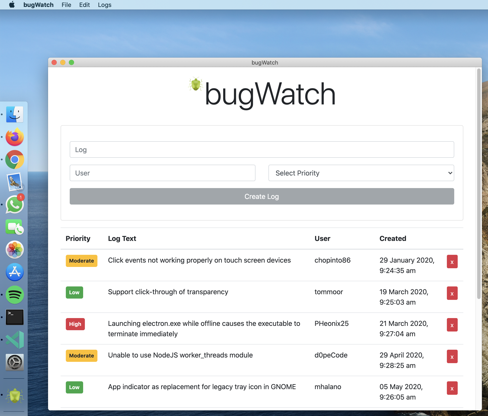

# bugWatch

Bug tracking app built using Electron.



## Features

- Bug logs include a log description, user, and priority of low, moderate, or high
- Remove logs that have been completed
- Logs are saved in a database

## Setup

To clone and run this application, you'll need [Git](https://git-scm.com/) and [Node.js](https://nodejs.org/) (which comes with [npm](https://www.npmjs.com/)) installed on your computer. From your command line:

```sh
# Clone this repository
$ git clone https://github.com/andyrutherford/beer-cooler.git

# Install dependencies
$ npm install
```

In config/db.js replace process.env.MONGO_URI with your own mongoDB URI:

```sh
    const conn = await mongoose.connect(<your-mongodb-uri>, {
        useNewUrlParser: true,
        useCreateIndex: true,
        useUnifiedTopology: true,
    });
```

```sh
# Run the app
$ npm run start

# Build the app (automatic)
$ npm run package

# Build the app (manual)
$ npm run build
```

## Tech

- [Electron](https://www.electronjs.org/) - framework for creating native applications with web technologies like JavaScript
- [ReactJS](https://reactjs.org/) - A JavaScript library for building user interfaces
- [node.js](http://nodejs.org) - evented I/O for the backend
- [mongoDB](https://www.mongodb.com/) - general purpose, document-based, distributed database
- [mongoose](https://mongoosejs.com/) - MongoDB object modeling for Node.js
- [React Bootstrap](https://react-bootstrap.github.io/) - Bootstrap 4 components built with React.

## License

MIT
